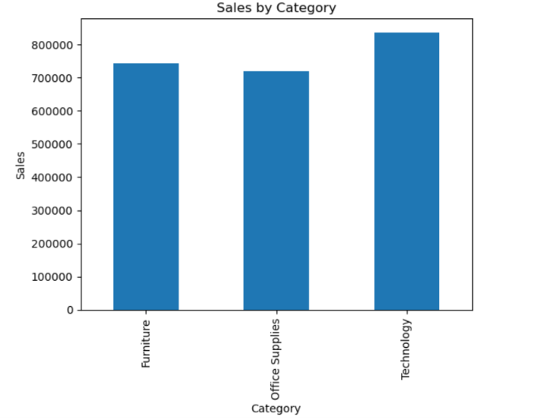
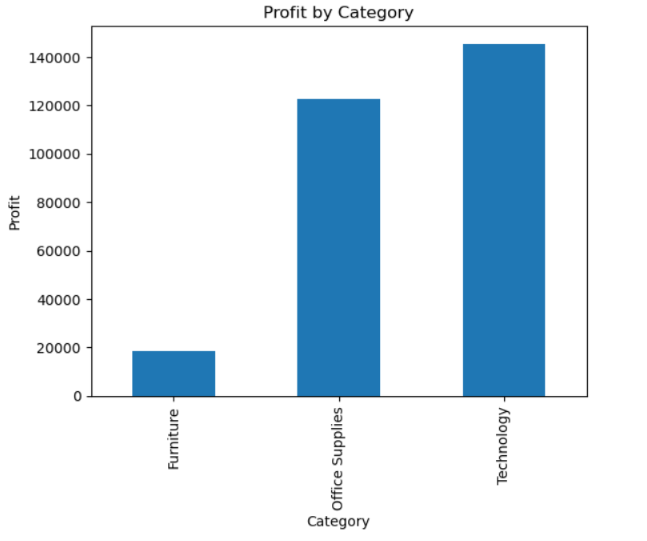
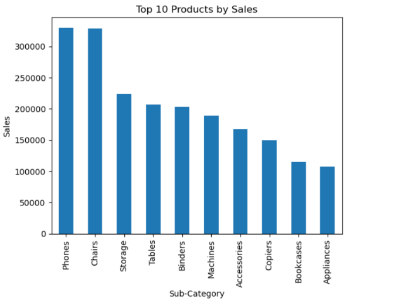

# Retail-Sales-Data-Analysis
Retail sales analysis using Python, Pandas, NumPy, Matplotlib and Jupyter Notebook.

# Retail Sales Data Analysis
## Overview
This project analyzes a retail sales dataset using Python, Pandas, NumPy, and Matplotlib to identify sales trends, profitability patterns, and business insights.

## Dataset Information
- Total Records: 9,994
- Categories:
  - Technology
  - Furniture
  - Office Supplies

## Tools Used
- Python
- Pandas
- NumPy
- Matplotlib
- Jupyter Notebook

## Key Insights
### Sales Analysis
- Technology generated the highest sales revenue ($836K+).
- Furniture generated sales of approximately $742K.
- Office Supplies recorded the highest transaction volume (6,026 orders).

### Profit Analysis
- Technology generated the highest profit ($145K+).
- Office Supplies generated profit of approximately $122K.
- Furniture generated high sales but only $18K profit, indicating lower profit margins.

### Regional Analysis
- California generated the highest sales ($457K+) and profit ($76K+).
- New York generated sales of $310K+ and profit of $74K+.
- Texas showed strong sales performance but did not rank among the most profitable states.

## Business Recommendations
- Increase focus on Technology products due to strong profitability.
- Improve Furniture pricing and margin strategies.
- Expand business efforts in California and New York.
- Analyze profitability challenges in Texas.

## Dataset
The project uses the Sample Superstore dataset containing 9,994 retail transactions.
Features include:
- Order Date
- Category
- Sub-Category
- Sales
- Profit
- Quantity
- Discount
- State
- Region
## Visualizations

### Sales by Category

### Profit by Category

### Top States by Sales

## Conclusion
The analysis identified key revenue drivers, profitable product categories, and high-performing regions that can support data-driven business decision-making.

## Author

k.Loknath Chari
